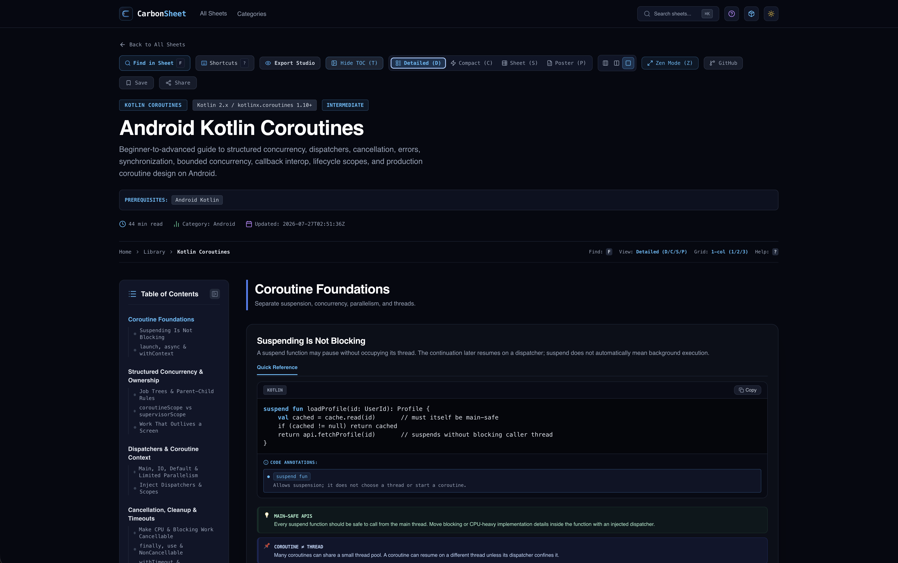
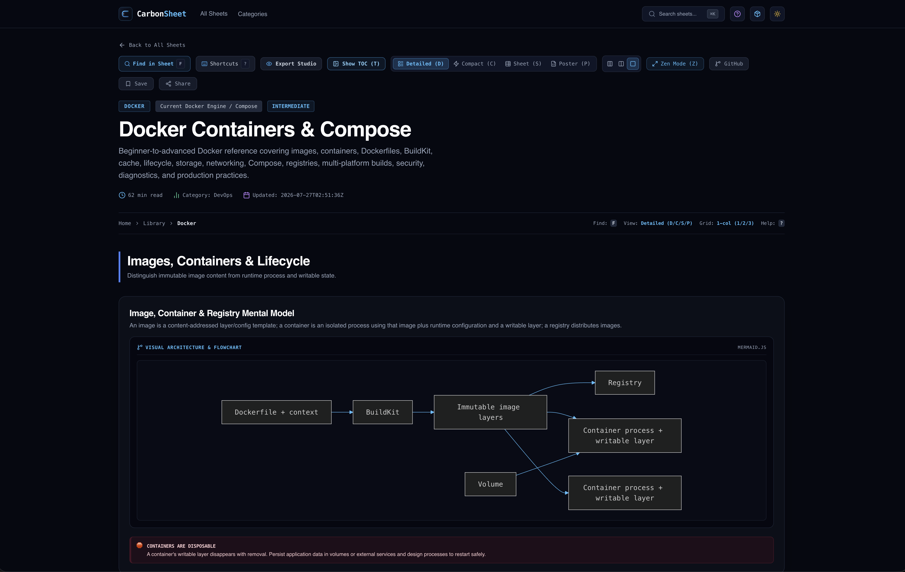

# carbonsheet
This is a repositories containing CarbonSheet registeries for all cheatsheets. The web app will make use of this repo as the database for all the cheatsheets. You can also host your own cheatsheets in your own public GitHub repository. Check below for more information. 

## ✨ Features

- **🌐 Community-First & Self-Hostable:** Host cheatsheet registries directly on your own public GitHub repository.
- **⚡ Power-User Navigation:** Lightning-fast keyboard shortcuts for instant searching and command execution.
- **📐 Flexible Schemas:** Rich JSON schema support for building structured, highly expressive cheatsheets.
- **📥 Import & Export:** Easily import from external sources and export cheatsheets to **PNG** or **PDF**.
- **🎨 Dynamic View Modes:** Toggle between Detailed, Compact, Sheet, and Poster grid layouts.
- **👁️ Distraction-Free Zen Mode:** Focus mode designed for uninterrupted reading and reference.
- **🌓 Light & Dark Theme:** Full native support for dark and light modes.
- **🔓 100% Free & Privacy-Friendly:** No account required, completely free to use.

## Screenshots
### Main Page

### CheetSheets Page

## Cheatsheet Schemas
Check the SCHEMA.md to learn how to create it. 

## How to host Your Own Cheatsheets: 
1. Clone this repository
2. Create or edit a cheat sheet using the [web editor](https://carbonsheets.vercel.app/editor)  
3. or Generate a cheat sheet with AI (optional).
Ask your AI assistant to read the SCHEMA.md file in the repository and generate a cheat sheet that follows the schema. Output in JSON

4. Publish your cheat sheet.
Add your new cheat sheet entry to carbonsheet-registry.json, then commit and push the changes to your own public GitHub repository.

5. Import your cheat sheets on the web app
Open the [registry page](https://carbonsheets.vercel.app/registry):  Add your GitHub repository URL, then import the cheat sheets you'd like to use

Schema Documentation: https://carbonsheets.vercel.app/schema  
Schema Editor: https://carbonsheets.vercel.app/editor  
Web App: https://carbonsheets.vercel.app

## Keyboard Shortcuts Reference
Use the shortcuts to navigate faster in cheatsheet: 

| Category | Shortcut (macOS) | Shortcut (Windows) | Action / Command |
| :--- | :--- | :--- | :--- |
| **Search & Commands** | `F` / `⌘F` | `Ctrl + F` | In-Sheet Search |
| | `⌘K` | `Ctrl + K` | Global Command Palette |
| **Navigation & UI** | `T` | `T` | Toggle Sidebar |
| | `?` | `?` | Shortcuts Guide |
| **View Modes** | `D` | `D` | Detailed View |
| | `C` | `C` | Compact View |
| | `S` | `S` | Sheet View |
| | `P` | `P` | Poster View |
| | `M` | `M` | Cycle Views |
| **Grid Layouts** | `1` | `1` | 1-Column Layout |
| | `2` | `2` | 2-Column Layout |
| | `3` | `3` | 3-Column Layout |
| | `G` | `G` | Cycle Columns |
| **Focus & Controls** | `Z` | `Z` | Toggle Zen Mode |
| | `Esc` | `Esc` | Exit Zen / Close Modals |

## License 
CarbonSheet is licensed under the [Creative Commons Attribution-NonCommercial-ShareAlike 4.0 International License](https://creativecommons.org/licenses/by-nc-sa/4.0/). See the [LICENSE](LICENSE) file for more information.
